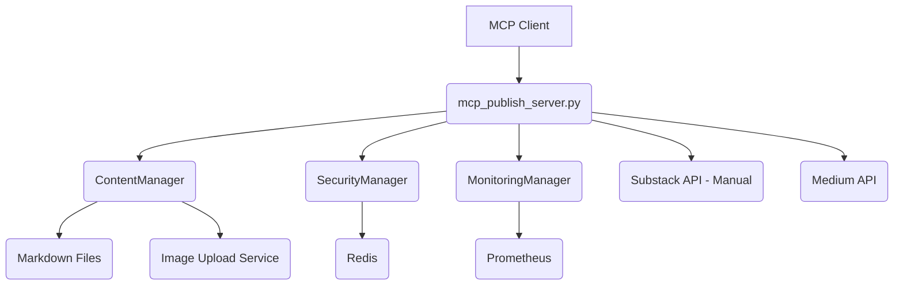
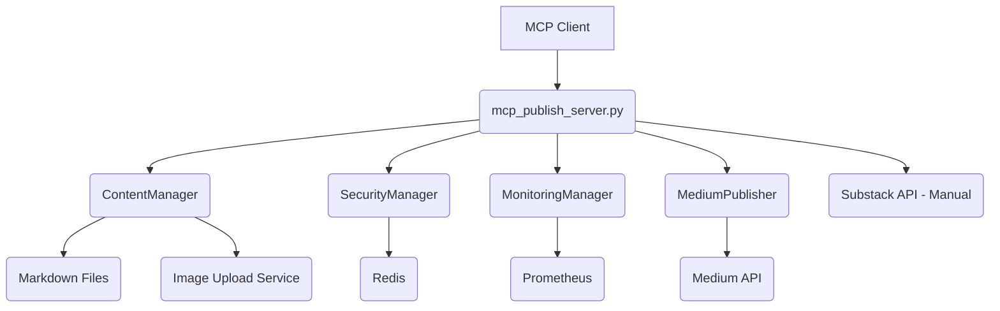

# Codebase Architecture Improvement Plan

This document outlines the current architecture of the MCP Publish Flow codebase and proposes a plan for improvements based on the analysis performed.

## Current Architecture Overview

The project implements an MCP server using `FastMCP` and is structured into several modules:

*   `mcp_publish_server.py`: Main entry point, initializes managers, registers MCP tools, and contains some validation/API helper logic.
*   `content_manager.py`: Handles markdown processing, frontmatter, image handling, validation, and sanitization.
*   `security.py`: Manages JWT authentication and Redis-based rate limiting.
*   `monitoring.py`: Collects system and application metrics using Prometheus and provides a health check.
*   `test_mcp_publish_server.py`: Contains unit tests for some utility functions.
*   `README.md`: Project documentation, setup, usage, and configuration details.
*   `requirements.txt`: Lists project dependencies.

The architecture promotes separation of concerns across modules, with `mcp_publish_server.py` acting as the central coordinator and interface layer.

## Identified Areas for Improvement

Based on the codebase review, the following areas have been identified for potential improvement:

1.  **Further Modularization and Separation of Concerns:** Some utility functions and API interaction logic are currently in `mcp_publish_server.py` and could be better placed in dedicated modules or classes.
2.  **Enhanced Error Handling:** Error handling could be more specific, catching distinct exception types rather than broad `Exception`s, and providing consistent error responses.
3.  **Configuration Management:** Environment variable loading is spread across files; centralizing this would improve maintainability.
4.  **Testing Coverage:** Existing tests are limited; expanding coverage to manager classes and tool functions is needed.
5.  **API Key Handling:** Ensure secure handling of API keys throughout the application.
6.  **Dependency Management:** Clearly document and handle potential unavailability of external dependencies like Redis and the image upload service.

## Proposed Plan for Improvements

The following steps are proposed to address the identified areas for improvement:

1.  **Refactor `mcp_publish_server.py`:**
    *   Move validation functions (`validate_file_path`, `validate_title`, `validate_subtitle`, `validate_tags`, `read_markdown_file`) into the `ContentManager` or a new `ValidationManager`.
    *   Move the `make_api_request` function into a new `APIManager` or within dedicated publisher classes.
2.  **Create Dedicated Publisher Classes:**
    *   Introduce a `MediumPublisher` class (and potentially a `SubstackPublisher` if a future API becomes available) to encapsulate the logic for interacting with the specific platform APIs. This class would use the `APIManager` (or similar) for making requests.
3.  **Improve Error Handling:**
    *   Define more specific custom exception types for different error scenarios (e.g., `ContentValidationError`, `AuthenticationError`, `RateLimitError`, `APIError`).
    *   Update the `try...except` blocks in the MCP tool functions to catch these specific exceptions and provide more informative error messages.
4.  **Enhance Testing:**
    *   Write unit tests for the methods within `ContentManager`, `SecurityManager`, and `MonitoringManager`.
    *   Write integration tests for the MCP tools to ensure they correctly interact with the manager classes and external dependencies (using mocks where necessary).
5.  **Centralize Configuration:**
    *   Create a `config.py` file or a configuration class that loads and validates all necessary environment variables in one place. Pass this configuration object to the manager classes during initialization.

Potential updated architecture diagram:

This plan aims to improve the codebase's structure, maintainability, and testability.