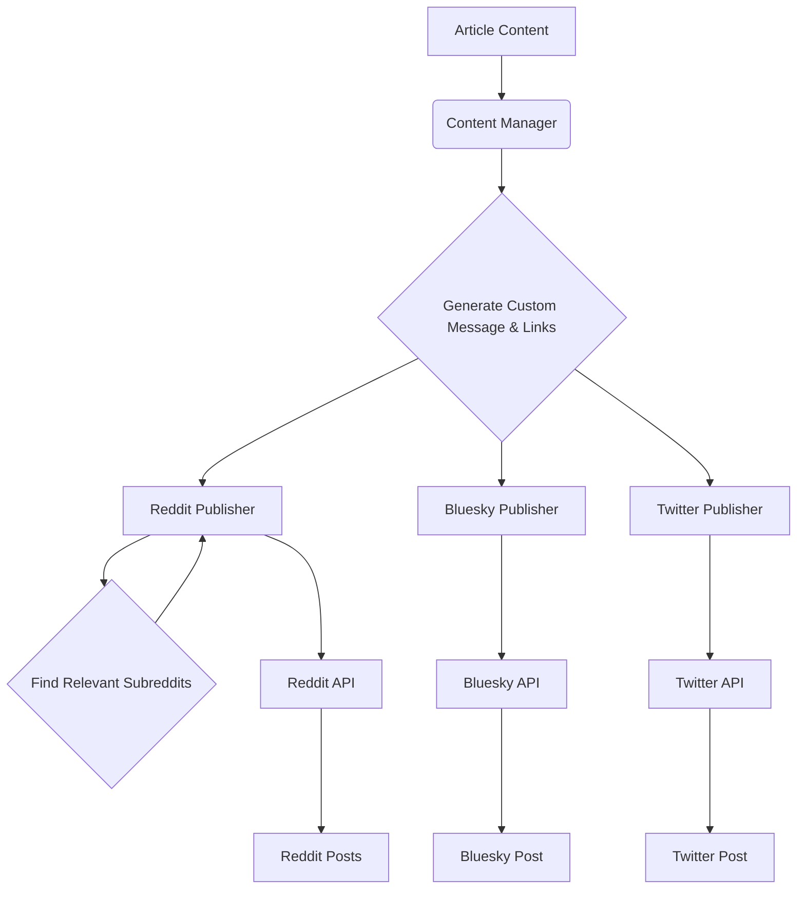

# Plan for Adding Twitter, Bluesky, and Reddit Posting

This plan outlines the steps to integrate Twitter, Bluesky, and Reddit posting capabilities into the project, including potential problems and a proposed architecture.

**Objective:** Add automated posting functionality for Twitter, Bluesky, and Reddit, including finding relevant subreddits for Reddit posts.

**Requirements:**
- Custom message for each platform with links to the Medium and Substack articles.
- Authentication using API keys.
- For Reddit, automatically find 10 relevant subreddits based on high activity and relevance to the article's topic.

**Plan:**

1.  **Create New Publisher Modules:**
    *   Develop three new Python modules: `twitter_publisher.py`, `bluesky_publisher.py`, and `reddit_publisher.py` within the `publishers/` directory.
    *   Each module will contain a class (e.g., `TwitterPublisher`, `BlueskyPublisher`, `RedditPublisher`) responsible for handling the specific API interactions for that platform.
    *   These classes will likely need to be initialized with API keys or other necessary credentials, potentially loaded from a configuration file or environment variables.

2.  **Implement API Integration:**
    *   Within each publisher module, implement methods for creating and sending posts using the respective platform's API.
    *   This will involve making HTTP requests to the API endpoints, including handling authentication, formatting the request payload with the custom message and links, and processing the API response.
    *   Error handling and retry logic should be included, similar to the `MediumPublisher`.

3.  **Develop Custom Message Generation:**
    *   Create a new component or modify an existing one (potentially within `src/content_manager.py` or a new `src/message_generator.py`) to generate the custom message for each platform.
    *   This component will need access to the article's title, summary (if available), and the generated links for the Medium and Substack articles.
    *   Consider potential character limits for platforms like Twitter when generating messages.

4.  **Implement Subreddit Finding Logic (Reddit):**
    *   Within `publishers/reddit_publisher.py` or a dedicated utility module (e.g., `src/reddit_utils.py`), implement the logic to find 10 relevant subreddits.
    *   This could involve using the Reddit API (e.g., `praw` library) to search for subreddits based on keywords extracted from the article's title or content.
    *   The criteria for "high activity and relevance" will need to be defined. This could involve looking at subscriber counts, recent post activity, or using search result relevance scores.

5.  **Integrate New Publishers:**
    *   Modify the main publishing workflow (likely in `mcp_publish_server.py` or a similar orchestrator) to include the new publishers.
    *   This will involve adding logic to call the appropriate publisher class based on the user's request or a configuration.
    *   The workflow should handle passing the necessary data (custom message, links, etc.) to each publisher.

**Proposed Architecture:**

**Potential Problems and Mitigation:**

1.  **API Rate Limits:**
    *   **Problem:** Exceeding API request limits for Twitter, Bluesky, or Reddit can lead to temporary or permanent blocking.
    *   **Mitigation:** Implement robust rate-limiting handling in each publisher module, including delays and retry mechanisms based on API documentation. Use techniques like token buckets or leaky buckets if necessary.

2.  **Authentication and API Key Management:**
    *   **Problem:** Securely storing and managing API keys is crucial to prevent unauthorized access.
    *   **Mitigation:** Use environment variables or a secure configuration management system (like Docker secrets or a dedicated secret management tool) instead of hardcoding keys in the code.

3.  **Content Formatting and Character Limits:**
    *   **Problem:** Different platforms have varying character limits and formatting requirements.
    *   **Mitigation:** The custom message generation component should be aware of these limits and potentially truncate or adapt messages accordingly. Provide clear error messages if content is too long.

4.  **Finding Relevant Subreddits:**
    *   **Problem:** Automatically finding truly relevant and active subreddits can be challenging and may require fine-tuning the search criteria and potentially filtering results.
    *   **Mitigation:** Start with a simple keyword-based search and iteratively refine the process. Consider incorporating factors like subscriber count, recent activity, and community guidelines. Allow for manual override or review of suggested subreddits.

5.  **API Changes and Maintenance:**
    *   **Problem:** External APIs can change, requiring updates to the publisher modules.
    *   **Mitigation:** Stay informed about API updates and maintain clear documentation for each publisher module. Implement monitoring to detect API errors quickly.

6.  **Error Handling and Monitoring:**
    *   **Problem:** Errors during the publishing process (e.g., network issues, invalid credentials, API errors) need to be handled gracefully.
    *   **Mitigation:** Implement comprehensive error handling and logging. Integrate with the existing monitoring system (`src/monitoring.py`) to track publishing success and failures.

7.  **User Experience for Custom Messages:**
    *   **Problem:** Generating effective custom messages automatically can be difficult.
    *   **Mitigation:** Provide templates or options for generating messages. Allow for manual editing of the generated messages before publishing.